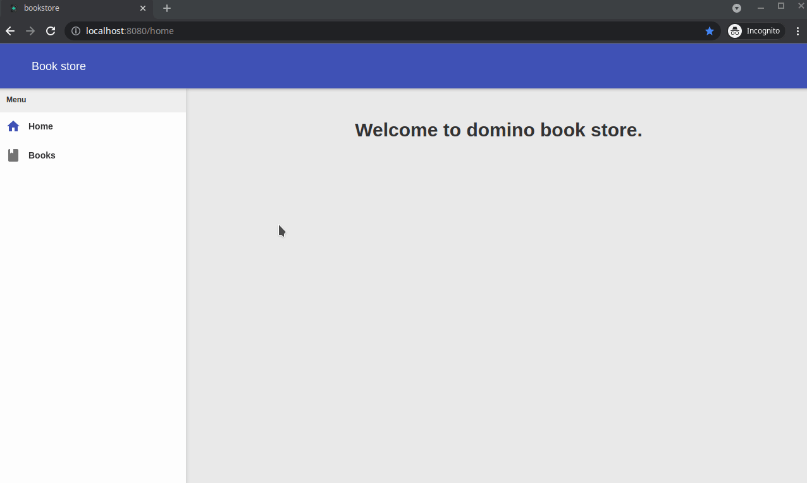

# View book details

To view/edit book details, we will first update the book list so that when we click on a book in the list it will change the token in the URL, the new token will activate the book details proxy, we will initially open the book in read only mode, then when we click edit button we will turn it into editable mode, we will preserve the edit mode between refreshes using a query parameter in the URL.

- Open `BooksViewImpl` and add a `RowClickPlugin` to the table config, which will make the clicking on a row in the table calls `uiHandlers.onBookSelected(book)`

    ```java
    package org.dominokit.samples.library.client.views.ui;
    
    import elemental2.dom.HTMLDivElement;
    import org.dominokit.domino.api.client.annotations.UiView;
    import org.dominokit.domino.ui.Typography.Paragraph;
    import org.dominokit.domino.ui.cards.Card;
    import org.dominokit.domino.ui.datatable.ColumnConfig;
    import org.dominokit.domino.ui.datatable.DataTable;
    import org.dominokit.domino.ui.datatable.TableConfig;
    import org.dominokit.domino.ui.datatable.plugins.EmptyStatePlugin;
    import org.dominokit.domino.ui.datatable.plugins.RowClickPlugin;
    import org.dominokit.domino.ui.datatable.store.LocalListDataStore;
    import org.dominokit.domino.ui.dialogs.ConfirmationDialog;
    import org.dominokit.domino.ui.grid.Column;
    import org.dominokit.domino.ui.grid.Row;
    import org.dominokit.domino.ui.icons.Icons;
    import org.dominokit.domino.ui.modals.BaseModal;
    import org.dominokit.domino.ui.notifications.Notification;
    import org.dominokit.domino.ui.utils.DominoElement;
    import org.dominokit.domino.ui.utils.TextNode;
    import org.dominokit.domino.view.BaseElementView;
    import org.dominokit.samples.library.client.presenters.BooksProxy;
    import org.dominokit.samples.library.client.views.BooksView;
    import org.dominokit.samples.library.shared.model.Book;
    
    import java.util.List;
    
    import static org.jboss.elemento.Elements.b;
    
    @UiView(presentable = BooksProxy.class)
    public class BooksViewImpl extends BaseElementView<HTMLDivElement> implements BooksView{
    
        private BooksUiHandlers uiHandlers;
        private LocalListDataStore<Book> dataStore;
        private DominoElement<HTMLDivElement> root = DominoElement.div();
    
        @Override
        public HTMLDivElement init() {
    
            TableConfig<Book> tableConfig = new TableConfig<Book>()
                    .addColumn(ColumnConfig.<Book>create("title", "Title")
                            .setCellRenderer(cellInfo -> TextNode.of(cellInfo.getRecord().getTitle()))
                    )
                    .addColumn(ColumnConfig.<Book>create("author", "Author")
                            .setCellRenderer(cellInfo -> TextNode.of(cellInfo.getRecord().getAuthor()))
                    )
                    .addColumn(ColumnConfig.<Book>create("year", "Year")
                            .setCellRenderer(cellInfo -> TextNode.of(cellInfo.getRecord().getYear() + ""))
                    )
                    .addColumn(ColumnConfig.<Book>create("publisher", "Publisher")
                            .setCellRenderer(cellInfo -> TextNode.of(cellInfo.getRecord().getPublisher()))
                    )
                    .addColumn(ColumnConfig.<Book>create("price", "Price")
                            .setCellRenderer(cellInfo -> TextNode.of(cellInfo.getRecord().getCost() + ""))
                    )
                    .addColumn(ColumnConfig.<Book>create("action", "Action")
                            .setCellRenderer(cellInfo -> Icons.ALL.trash_can_mdi()
                                    .clickable()
                                    .addClickListener(evt -> {
                                        evt.stopPropagation();
                                        confirmDelete(cellInfo.getRecord());
                                    })
                                    .element())
                    )
                    .addPlugin(new EmptyStatePlugin<>(Icons.ALL.format_line_weight_mdi(), "No books found"))
                    // adding the row click plugin
                    .addPlugin(new RowClickPlugin<>(tableRow -> uiHandlers.onBookSelected(tableRow.getRecord())));
    
            dataStore = new LocalListDataStore<>();
            DataTable<Book> dataTable = new DataTable<>(tableConfig, dataStore);
    
            root
                    .appendChild(Row.create()
                            .appendChild(Column.span12()
                                    .appendChild(Card.create("Books")
                                            .appendChild(dataTable)
                                    )
                            )
                    );
    
            return root.element();
        }
    
        @Override
        public void setUiHandlers(BooksUiHandlers uiHandlers) {
            this.uiHandlers = uiHandlers;
        }
    
        @Override
        public void setBooks(List<Book> books) {
            dataStore.setData(books);
        }
    
        @Override
        public void showError(String errorMessage) {
            Notification.createDanger(errorMessage).show();
        }
    
        public void confirmDelete(Book book) {
            ConfirmationDialog.create("Delete Book")
                    .appendChild(Paragraph.create("Are you sure you want to delete book : ")
                            .appendChild(b(book.getTitle()))
                    )
                    .onConfirm(dialog -> {
                        uiHandlers.deleteBook(book);
                        dialog.close();
                    })
                    .onReject(BaseModal::close)
                    .open();
        }
    }
    ```
- Create the `void onBookSelected(Book book)` in the `BooksUiHandlers` interface.
- Implement the new method in the `BooksProxy` to fire the token `books` with the selected book title appended as a path.
  
  ```java
      @Override
      public void onBookSelected(Book book) {
          history().fireState(history().currentToken().appendPath(book.getTitle()).appendParameter("editable", "false"));
      }
  ```
- Use Domino-cli to create a new proxy `BookDetailsProxy` by executing the following command

  `dominokit gen module -n library -p bookDetails -sp library`
- In the `library-shared` module delete the `BookDetailsService`, we will be using the `BooksService` instead.
- In the `BookDetailsProxy` remove the `BookDetailsService` import.
- Set the proxy parent to `books`.
- Set the routing token to `books/:title`.
- Set the slot to `Slots.CONTENT`
- Add a field of type `Book` and the name `book` to keep a reference to the book we are viewing.
- Add a field of type `String` and name `title` annotated with `@PathParameter`
- Add a field of type `List<String` and name `editable` annotated with `@QueryParameter`
  > Notice that query parameters are always lists, since they accept multiple values
- Delete the `onBookDetailsInit` method.
- Remove the body of the `onBookDetailsRevealed` details method, and replace it with a call to load the book
  ```java
      @OnReveal
      public void onBookDetailsRevealed() {
          BooksServiceFactory.INSTANCE
                  .get(title)
                  .onSuccess(book -> editBook(book, isEditableState()))
                  .onFailed(failedResponseBean -> view.onError(failedResponseBean.getBody()))
                  .send();
      }
  ```
- Implement the `isEditableState()` to read the edit state from the query parameter
  ```java
      private boolean isEditableState() {
          return nonNull(editable) && !editable.isEmpty() && Boolean.parseBoolean(editable.get(0));
      }
  ```
- Implement the `editBook` method to keep a reference to the book, edit the book in the view, and change the edit state based on the editableState flag.
  
  ```java
      private void editBook(Book book, boolean editableState) {
          this.book= book;
          view.edit(book);
          setEditable(editableState);
      }
  ```
- Implement the `setEditable` method to update the URL with the editable flag
  ```java
    private void setEditable(boolean editableState) {
        view.setEditable(editableState);
        if (history().currentToken().hasQueryParameter("editable")) {
            history().pushState(history().currentToken().replaceParameter("editable", "editable", editableState + ""));
        } else {
            history().pushState(history().currentToken().addQueryParameter("editable", editableState + ""));
        }
    }
  ```
- Next we implement the methods required by the view, but first we create the needed methods in the `BookDetailsView`
- In the `BookDetailsView` interface remove the `welcomeMessage` method and add the methods `void onError(String message)`, `void setEditable(boolean editable)`,`void edit(Book book)`, `Book save()`

In next steps we will implement the UI for books details, we will implement the actual form that display the book details as a separate component to use it later for the creating a new book, we will also use  to bind the fields and values from the book pojo.
- Add the GTW editors processor maven dependency to the `library-frontend-ui` module

  ```xml
  <dependency>
      <groupId>org.gwtproject.editor</groupId>
      <artifactId>gwt-editor-processor</artifactId>
      <version>1.0.0-RC1</version>
      <scope>provided</scope>
  </dependency>
  ```

- Without digging deep in the details of the `BookComponent`, here is how it should look like

  ```java
  package org.dominokit.samples.library.client.views.ui;
  
  import elemental2.dom.HTMLDivElement;
  import org.dominokit.domino.ui.forms.DoubleBox;
  import org.dominokit.domino.ui.forms.FieldsGrouping;
  import org.dominokit.domino.ui.forms.Select;
  import org.dominokit.domino.ui.forms.SelectOption;
  import org.dominokit.domino.ui.forms.TextBox;
  import org.dominokit.domino.ui.forms.validations.ValidationResult;
  import org.dominokit.domino.ui.grid.Column;
  import org.dominokit.domino.ui.grid.Row;
  import org.dominokit.domino.ui.utils.BaseDominoElement;
  import org.dominokit.domino.ui.utils.DominoElement;
  import org.dominokit.samples.library.shared.model.Book;
  import org.gwtproject.editor.client.Editor;
  import org.gwtproject.editor.client.SimpleBeanEditorDriver;
  import org.gwtproject.editor.client.annotation.IsDriver;
  
  import java.util.stream.IntStream;
  
  public class BookComponent extends BaseDominoElement<HTMLDivElement, BookComponent> implements Editor<Book> {
  
      @IsDriver
      interface Driver extends SimpleBeanEditorDriver<Book, BookComponent> {
      }
  
      TextBox title;
      TextBox author;
      Select<Integer> year;
      TextBox publisher;
      DoubleBox cost;
  
      private DominoElement<HTMLDivElement> root = DominoElement.div();
  
      private FieldsGrouping fieldsGrouping = FieldsGrouping.create();
      private Driver driver;
      private Book book;
  
      public BookComponent() {
          init(this);
          title = TextBox.create("Title")
                  .setFixErrorsPosition(true)
                  .groupBy(fieldsGrouping);
  
          author = TextBox.create("Author")
                  .setFixErrorsPosition(true)
                  .groupBy(fieldsGrouping);
  
          year = Select.<Integer>create("Year")
                  .apply(self -> {
                      IntStream.range(1500, 2022)
                              .forEach(value -> self.appendChild(SelectOption.<Integer>create(value, value + "", value + "")));
                  })
                  .groupBy(fieldsGrouping);
  
          publisher = TextBox.create("Publisher")
                  .setFixErrorsPosition(true)
                  .groupBy(fieldsGrouping);
  
          cost = DoubleBox.create("Price")
                  .addValidator(() -> {
                      if (cost.getValue() < 0) {
                          return ValidationResult.invalid("Price should not be negative");
                      }
                      return ValidationResult.valid();
                  })
                  .groupBy(fieldsGrouping);
  
          fieldsGrouping.setRequired(true);
  
          root.appendChild(DominoElement.div()
                  .appendChild(Row.create()
                          .appendChild(Column.span12()
                                  .appendChild(title)
                          )
                  )
                  .appendChild(Row.create()
                          .appendChild(Column.span12()
                                  .appendChild(author)
                          )
                  )
                  .appendChild(Row.create()
                          .appendChild(Column.span12()
                                  .appendChild(year)
                          )
                  )
                  .appendChild(Row.create()
                          .appendChild(Column.span12()
                                  .appendChild(publisher)
                          )
                  )
                  .appendChild(Row.create()
                          .appendChild(Column.span12()
                                  .appendChild(cost)
                          )
                  )
  
          );
  
          driver = new BookComponent_Driver_Impl();
          driver.initialize(this);
      }
  
      public boolean isValid(){
          return fieldsGrouping.validate().isValid();
      }
  
      public void edit(Book book) {
          driver.edit(book);
      }
  
      public Book save() {
          return driver.flush();
      }
  
      public void setEditable(boolean editable){
          fieldsGrouping.setReadOnly(!editable);
      }
      @Override
      public HTMLDivElement element() {
          return root.element();
      }
  }
  ```
  We will be delegating calls from the view to this component.

- In the `BookDetailsViewImpl` We add a field of type `BookComponent` and init the view with a layout that adds `edit`, `save`, `cancel` and `backToList` buttons, then we implement the `edit` and `save` methods to delegate to the `BookComponent`, we implement the `showError` method to show an error notification, and finally implement the `setEditable` to toggle the buttons visibility.

  ```java
  package org.dominokit.samples.library.client.views.ui;
  
  import elemental2.dom.HTMLDivElement;
  import org.dominokit.domino.api.client.annotations.UiView;
  import org.dominokit.domino.ui.button.Button;
  import org.dominokit.domino.ui.cards.Card;
  import org.dominokit.domino.ui.grid.Column;
  import org.dominokit.domino.ui.grid.Row;
  import org.dominokit.domino.ui.grid.flex.FlexItem;
  import org.dominokit.domino.ui.grid.flex.FlexLayout;
  import org.dominokit.domino.ui.icons.Icons;
  import org.dominokit.domino.ui.notifications.Notification;
  import org.dominokit.domino.ui.utils.DominoElement;
  import org.dominokit.domino.view.BaseElementView;
  import org.dominokit.samples.library.client.presenters.BookDetailsProxy;
  import org.dominokit.samples.library.client.views.BookDetailsView;
  import org.dominokit.samples.library.shared.model.Book;
  
  @UiView(presentable = BookDetailsProxy.class)
  public class BookDetailsViewImpl extends BaseElementView<HTMLDivElement> implements BookDetailsView{
  
    private BookDetailsUiHandlers uiHandlers;
    private DominoElement<HTMLDivElement> root = DominoElement.div();
    private BookComponent bookComponent;
    private FlexItem<HTMLDivElement> editElement;
    private FlexItem<HTMLDivElement> saveElement;
    private FlexItem<HTMLDivElement> cancelElement;
    private FlexItem<HTMLDivElement> backToListElement;
  
    @Override
    public HTMLDivElement init() {
      bookComponent = new BookComponent();
  
      editElement = FlexItem.create();
      saveElement = FlexItem.create();
      cancelElement = FlexItem.create();
      backToListElement = FlexItem.create();
      root
              .appendChild(Card.create("Book details")
                      .appendChild(bookComponent)
                      .appendChild(Row.create()
                              .appendChild(Column.span6()
                                      .appendChild(FlexLayout.create()
                                              .setGap("10px")
                                              .appendChild(editElement
                                                      .appendChild(Button.createPrimary(Icons.ALL.pencil_mdi())
                                                              .setContent("Edit")
                                                              .setMinWidth("120px")
                                                              .addClickListener(evt -> uiHandlers.onEdit()))
                                              )
                                              .appendChild(saveElement
                                                      .appendChild(Button.createPrimary(Icons.ALL.floppy_mdi())
                                                              .setContent("Save")
                                                              .setMinWidth("120px")
                                                              .addClickListener(evt -> uiHandlers.onSave()))
                                              )
                                              .appendChild(cancelElement
                                                      .appendChild(Button.create(Icons.ALL.floppy_mdi())
                                                              .setContent("Cancel")
                                                              .linkify()
                                                              .setMinWidth("120px")
                                                              .addClickListener(evt -> uiHandlers.onCancel()))
                                              )
                                              .appendChild(backToListElement
                                                      .appendChild(Button.create(Icons.ALL.view_list_mdi())
                                                              .setContent("Books list")
                                                              .linkify()
                                                              .setMinWidth("120px")
                                                              .addClickListener(evt -> uiHandlers.onBackToList())))
                                      )
                              )
                      )
              );
      return root.element();
    }
  
    @Override
    public void edit(Book book) {
      bookComponent.edit(book);
    }
  
    @Override
    public void onError(String message) {
      Notification.createDanger(message).show();
    }
  
    @Override
    public Book save() {
      return bookComponent.save();
    }
  
    public void setEditable(boolean editable){
      bookComponent.setEditable(editable);
      editElement.toggleDisplay(!editable);
      backToListElement.toggleDisplay(!editable);
      saveElement.toggleDisplay(editable);
      cancelElement.toggleDisplay(editable);
    }
  
    @Override
    public void setUiHandlers(BookDetailsUiHandlers uiHandlers) {
      this.uiHandlers = uiHandlers;
    }
  }
  ```
- Add the methods `onEdit`, `onSave`, `onCancel`, `onBackToList` to the `BookDetailsUiHandlers` interface.
- Implement the added methods in the `BookDetailsProxy` like the following 
- `onEdit` Well change the view editable state, and toggle the editable flag in the URL by calling `setEditable(true)`
  ```java
      @Override
      public void onEdit() {
          setEditable(true);
      }
  ```
- `onSave` Well make a rest call to update the book in the backend with the new data
  ```java
  @Override
  public void onSave() {
          BooksServiceFactory.INSTANCE
          .update(title, view.save())
          .onSuccess(book -> editBook(book, false))
          .onFailed(failedResponseBean -> view.onError(failedResponseBean.getBody()))
          .send();
  }
  ```

- `onCancel` Well cancel the edit operation and switch us back to readonly mode, and revert all changes we made to the book
  ```java
  @Override
  public void onCancel() {
          editBook(book, false);
  }
  ```
- `onBackToList` Will take us back to the books list
  ```java
  @Override
  public void onBackToList() {
          history().fireState("books");
  }
  ```
  
Once you made this changes we will have working book details view, we can try it out by rebuilding the app and then hit refresh on the browser, then in the book list click on any book from the list and notice the changes in the URL, then try to play around with the buttons, try to refresh the page while editing a book and test the behavior, the editable state should be maintained.

