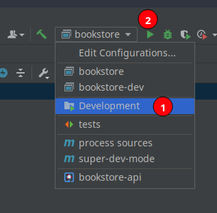
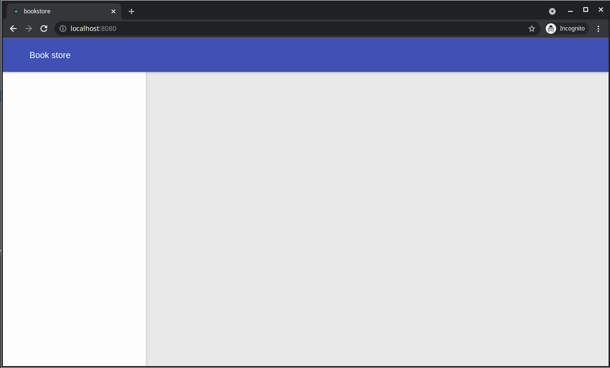

# Creating Book list screen

For the book list we will create a new module `library` and we will initialize it with a the `Books` proxy, this proxy will show a list of books

- In the root folder of the project open a terminal and execute the following command

  `dominokit gen module -n library -p books -sp library`
This will create a library module in the project with a books proxy

The books proxy will show up in the content panel, will use the `books` token, and this time will use the `BooksService` to load the books list from the books-api :

- Add `shell-shared` as a maven dependency in the `library-frontend` module ;
  ```xml
  <dependency>
      <groupId>org.dominokit.samples</groupId>
      <artifactId>shell-shared</artifactId>
      <version>${project.version}</version>
  </dependency>
  ```
- In the `BooksProxy` set the proxy name to  `books` and the parent to `shell`
- Set the slot to `Slots.CONTENT`
- Delete the `onBooksInit` method.
- Delete the body of the `onBooksRevealed` method.
- In the `BooksView` interface delete the `welcomeMessage` method.
- In the `library-shared` module we will add a package `model`
- In the model package add a class `Book`
  ```java
  package org.dominokit.samples.library.shared.model;
  
  import java.util.Objects;
  
  public class Book {
  
      private String title;
      private String author;
      private int year;
      private String publisher;
      private double cost;
  
      public Book() {
      }
  
      public Book(String title, String author, int year, String publisher, double cost) {
          this.title = title;
          this.author = author;
          this.year = year;
          this.publisher = publisher;
          this.cost = cost;
      }
  
      public String getTitle() {
          return title;
      }
  
      public void setTitle(String title) {
          this.title = title;
      }
  
      public String getAuthor() {
          return author;
      }
  
      public void setAuthor(String author) {
          this.author = author;
      }
  
      public int getYear() {
          return year;
      }
  
      public void setYear(int year) {
          this.year = year;
      }
  
      public String getPublisher() {
          return publisher;
      }
  
      public void setPublisher(String publisher) {
          this.publisher = publisher;
      }
  
      public double getCost() {
          return cost;
      }
  
      public void setCost(double cost) {
          this.cost = cost;
      }
  
      @Override
      public boolean equals(Object o) {
          if (this == o) return true;
          if (o == null || getClass() != o.getClass()) return false;
          Book book = (Book) o;
          return Objects.equals(title, book.title);
      }
  
      @Override
      public int hashCode() {
          return Objects.hash(title);
      }
  }
  ```
- Edit the `BooksService` interface to add a methods that represent the CRUD operations for book resource
  ```java
  package org.dominokit.samples.library.shared.services;
  
  import org.dominokit.rest.shared.request.service.annotations.RequestFactory;
  import org.dominokit.samples.library.shared.model.Book;
  
  import javax.ws.rs.Consumes;
  import javax.ws.rs.DELETE;
  import javax.ws.rs.POST;
  import javax.ws.rs.PUT;
  import javax.ws.rs.Path;
  import javax.ws.rs.GET;
  import javax.ws.rs.PathParam;
  import javax.ws.rs.Produces;
  import javax.ws.rs.core.MediaType;
  import java.util.List;
  
  @RequestFactory
  @Path("/books")
  public interface BooksService {
      @Path("")
      @GET
      @Produces(MediaType.APPLICATION_JSON)
      List<Book> list();
  
      @Path("")
      @POST
      @Produces(MediaType.APPLICATION_JSON)
      @Consumes(MediaType.APPLICATION_JSON)
      Book create(Book book);
  
      @Path("/{title}")
      @PUT
      @Produces(MediaType.APPLICATION_JSON)
      @Consumes(MediaType.APPLICATION_JSON)
      Book update(@PathParam("title") String title,  Book book);
  
      @Path("/{title}")
      @DELETE
      @Produces(MediaType.APPLICATION_JSON)
      @Consumes(MediaType.APPLICATION_JSON)
      Book delete(@PathParam("title") String title);
  
      @Path("/{title}")
      @GET
      @Produces(MediaType.APPLICATION_JSON)
      @Consumes(MediaType.APPLICATION_JSON)
      Book get(@PathParam("title") String title);
  }
  ```
  > We are using [Domino-rest](https://github.com/DominoKit/domino-rest) here, find more about this in domino-rest documentation.
- Back to the `BooksProxy` and rename the `onBooksRevealed` method to `listBooks`.
- In the `listBooks` method make a rest call to list books from the books-api, we will next implement this API.
  ```java
  @OnReveal
  public void listBooks() {
      BooksServiceFactory.INSTANCE
              .list()
              .onSuccess(books -> view.setBooks(books))
              .onFailed(failedResponse -> view.showError("Sadly no response from server.!"))
              .send();
  }
  ```
- Add the method `void setBooks(List<Book> books)` to the `BooksView` interface.
- Add the method `void showError(String message)` to the `BooksView` interface.
- Add `library-shared` as a maven dependency in the `bookstore-api` module ;
  ```xml
  <dependency>
      <groupId>org.dominokit.samples</groupId>
      <artifactId>library-shared</artifactId>
      <version>${project.version}</version>
  </dependency>
  ```
- Edit the file `src/main/resources/application.properties` in the `bookstore-api` and add `quarkus.http.cors=true`
  > Notice that we add this just for development, in production you need to make sure to configure CORS correctly.
- In the `bookstore-api` module add a rest resource that manage books from a map
  ```java
  package org.dominokit.samples;
  
  import org.dominokit.samples.library.shared.model.Book;
  import org.dominokit.samples.library.shared.services.BooksService;
  
  import javax.ws.rs.Path;
  import javax.ws.rs.WebApplicationException;
  import javax.ws.rs.core.Response;
  import java.util.ArrayList;
  import java.util.HashMap;
  import java.util.List;
  import java.util.Map;
  
  @Path("/books")
  public class BooksResource implements BooksService {
  
    private static Map<String, Book> books = new HashMap<>();
  
    static {
      books.put("Eloquent JavaScript, Third Edition", new Book("Eloquent JavaScript, Third Edition", "Marijn Haverbeke", 2018, "No Starch Press", 20.0));
      books.put("Practical Modern JavaScript", new Book("Practical Modern JavaScript", "Nicolás Bevacqua", 2017, "O'Reilly Media", 40.0));
      books.put("Understanding ECMAScript 6", new Book("Understanding ECMAScript 6", "Nicholas C. Zakas", 2016, "No Starch Press", 35.0));
      books.put("Speaking JavaScript", new Book("Speaking JavaScript", "Axel Rauschmayer", 2014, "O'Reilly Media", 80.0));
      books.put("Learning JavaScript Design Patterns", new Book("Learning JavaScript Design Patterns", "Addy Osmani", 2012, "O'Reilly Media", 30.0));
      books.put("You Don't Know JS Yet", new Book("You Don't Know JS Yet", "Kyle Simpson", 2020, "Independently published", 60.0));
      books.put("Everything you neeed to know about Git", new Book("Everything you neeed to know about Git", "Scott Chacon and Ben Straub", 2014, "Apress; 2nd edition", 75.0));
    }
  
    @Override
    public List<Book> list() {
      return new ArrayList<>(books.values());
    }
  
    @Override
    public Book create(Book book) {
      if (books.containsKey(book.getTitle())) {
        throw new WebApplicationException(Response.status(Response.Status.CONFLICT)
                .entity("Book with same title already exists")
                .build());
      }
      books.put(book.getTitle(), book);
      return book;
    }
  
    @Override
    public Book update(String title, Book book) {
      if (!books.containsKey(title)) {
        throw new WebApplicationException(Response.status(Response.Status.NOT_FOUND)
                .entity("No book with same title found")
                .build());
      }
      books.remove(title);
      books.put(book.getTitle(), book);
      return book;
    }
  
    @Override
    public Book delete(String title) {
      if (!books.containsKey(title)) {
        throw new WebApplicationException(Response.status(Response.Status.NOT_FOUND)
                .entity("No book with same title found")
                .build());
      }
      Book book = books.get(title);
      books.remove(title);
      return book;
    }
  
    @Override
    public Book get(String title) {
      if (!books.containsKey(title)) {
        throw new WebApplicationException(Response.status(Response.Status.NOT_FOUND)
                .entity("No book with same title found")
                .build());
      }
      return books.get(title);
    }
  }
  ```
- In `library-frontend-ui` module, edit the `BooksViewImpl` class and remove the `welcomeMessage` method.
- Implement the `init`,`listBooks`, and `showError` methods like the following :

  ```java
  package org.dominokit.samples.library.client.views.ui;
  
  import elemental2.dom.HTMLDivElement;
  import org.dominokit.domino.api.client.annotations.UiView;
  import org.dominokit.domino.ui.cards.Card;
  import org.dominokit.domino.ui.datatable.ColumnConfig;
  import org.dominokit.domino.ui.datatable.DataTable;
  import org.dominokit.domino.ui.datatable.TableConfig;
  import org.dominokit.domino.ui.datatable.plugins.EmptyStatePlugin;
  import org.dominokit.domino.ui.datatable.store.LocalListDataStore;
  import org.dominokit.domino.ui.grid.Column;
  import org.dominokit.domino.ui.grid.Row;
  import org.dominokit.domino.ui.icons.Icons;
  import org.dominokit.domino.ui.notifications.Notification;
  import org.dominokit.domino.ui.utils.DominoElement;
  import org.dominokit.domino.ui.utils.TextNode;
  import org.dominokit.domino.view.BaseElementView;
  import org.dominokit.samples.library.client.presenters.BooksProxy;
  import org.dominokit.samples.library.client.views.BooksView;
  import org.dominokit.samples.library.shared.model.Book;
  
  import java.util.List;
  
  @UiView(presentable = BooksProxy.class)
  public class BooksViewImpl extends BaseElementView<HTMLDivElement> implements BooksView{
  
      private BooksUiHandlers uiHandlers;
      private LocalListDataStore<Book> dataStore;
      private DominoElement<HTMLDivElement> root = DominoElement.div();
  
      @Override
      public HTMLDivElement init() {
  
          TableConfig<Book> tableConfig = new TableConfig<Book>()
                  .addColumn(ColumnConfig.<Book>create("title", "Title")
                          .setCellRenderer(cellInfo -> TextNode.of(cellInfo.getRecord().getTitle()))
                  )
                  .addColumn(ColumnConfig.<Book>create("author", "Author")
                          .setCellRenderer(cellInfo -> TextNode.of(cellInfo.getRecord().getAuthor()))
                  )
                  .addColumn(ColumnConfig.<Book>create("year", "Year")
                          .setCellRenderer(cellInfo -> TextNode.of(cellInfo.getRecord().getYear() + ""))
                  )
                  .addColumn(ColumnConfig.<Book>create("publisher", "Publisher")
                          .setCellRenderer(cellInfo -> TextNode.of(cellInfo.getRecord().getPublisher()))
                  )
                  .addColumn(ColumnConfig.<Book>create("price", "Price")
                          .setCellRenderer(cellInfo -> TextNode.of(cellInfo.getRecord().getCost() + ""))
                  )
                  .addPlugin(new EmptyStatePlugin<>(Icons.ALL.format_line_weight_mdi(), "No books found"));
  
          dataStore = new LocalListDataStore<>();
          DataTable<Book> dataTable = new DataTable<>(tableConfig, dataStore);
  
          root
                  .appendChild(Row.create()
                          .appendChild(Column.span12()
                                  .appendChild(Card.create("Books")
                                          .appendChild(dataTable)
                                  )
                          )
                  );
  
          return root.element();
      }
  
      @Override
      public void setUiHandlers(BooksUiHandlers uiHandlers) {
          this.uiHandlers = uiHandlers;
      }
  
      @Override
      public void setBooks(List<Book> books) {
          dataStore.setData(books);
      }
  
      @Override
      public void showError(String errorMessage) {
          Notification.createDanger(errorMessage).show();
      }
  }
  ```
- Next, since we added a completely new module, stop the running servers, run `mvn clean install` and run the application again, but this time also follow the instructions in the `bookstore-api` readme file to also run the api server.

- Once all 3 servers are running refresh the browser and click on books, a book list should show up.
- 
- In the `shell-shared` module delete the `ShellService` interface as we won't use it in this tutorial.
- In the `ShellProxy` remove the import of the `ShellServiceFactory`.
- In the `@AutoRoute` remove the argument `token` and add `routeOnce = true`.
- Add `@Singleton`annotation.
- Remove the `implements ShellView.ShellUiHandlers` part
- Delete the method `onShellInit`.
- Delete the content of the method `onShellRevealed` but keep the method.
- Now back to the `shell-shared` module and add a class `Slots` with 2 constants as the following
  ```java
  package org.dominokit.samples.shell.shared;
  
  public class Slots {
    public static final String LEFT_PANEL="left-panel";
    public static final String CONTENT="content";
  }
  ```
- Now back to the `ShellProxy` class, add the annotation `@RegisterSlots({Slots.LEFT_PANEL, Slots.CONTENT})`

  The shell proxy should look like this after those changes

  ```java
  package org.dominokit.samples.shell.client.presenters;
  
  import org.dominokit.domino.api.client.annotations.presenter.AutoReveal;
  import org.dominokit.domino.api.client.annotations.presenter.AutoRoute;
  import org.dominokit.domino.api.client.annotations.presenter.OnReveal;
  import org.dominokit.domino.api.client.annotations.presenter.PresenterProxy;
  import org.dominokit.domino.api.client.annotations.presenter.RegisterSlots;
  import org.dominokit.domino.api.client.annotations.presenter.Singleton;
  import org.dominokit.domino.api.client.annotations.presenter.Slot;
  import org.dominokit.domino.api.client.mvp.presenter.ViewBaseClientPresenter;
  import org.dominokit.domino.api.shared.extension.PredefinedSlots;
  import org.dominokit.samples.shell.client.views.ShellView;
  import org.dominokit.samples.shell.shared.Slots;
  import org.slf4j.Logger;
  import org.slf4j.LoggerFactory;
  
  @PresenterProxy(name = "Shell")
  @AutoRoute(routeOnce = true)
  @Singleton
  @Slot(PredefinedSlots.BODY_SLOT)
  @AutoReveal
  @RegisterSlots({Slots.LEFT_PANEL, Slots.CONTENT})
  public class ShellProxy extends ViewBaseClientPresenter<ShellView> {
  
      private static final Logger LOGGER = LoggerFactory.getLogger(ShellProxy.class);
  
      @OnReveal
      public void onShellRevealed() {
      }
  }
  ```

- Open the `ShellView` interface and delete `welcomeMessage` method.
- delete the `ShellUiHandlers` inner interface.
- Remove the extends of `HasUiHandlers`.

  The `ShellView` class should look like the following after those changes :

  ```java
  package org.dominokit.samples.shell.client.views;
  
  import org.dominokit.domino.api.client.mvp.view.ContentView;
  
  public interface ShellView extends ContentView {
  
  }
  ```

- In the `shell-frontend-ui` open the `ShellViewImpl` class.
- Remove the `uiHandlers` field and its setter method.
- Remove the `welcomeMessage` method.
- Now we will use [Domino-ui](https://github.com/DominoKit/domino-ui) to implement a simple layout.
- Add a `layout` field and implement the `init` method like the following :

  ```java
  package org.dominokit.samples.shell.client.views.ui;
  
  import elemental2.dom.HTMLDivElement;
  import org.dominokit.domino.api.client.annotations.UiView;
  import org.dominokit.domino.ui.layout.Layout;
  import org.dominokit.domino.view.BaseElementView;
  import org.dominokit.samples.shell.client.presenters.ShellProxy;
  import org.dominokit.samples.shell.client.views.ShellView;
  
  @UiView(presentable = ShellProxy.class)
  public class ShellViewImpl extends BaseElementView<HTMLDivElement> implements ShellView{
  
      private Layout layout= Layout.create("Book store");
  
      @Override
      public HTMLDivElement init() {
          layout.autoFixLeftPanel();
          return layout.element();
      }
  }
  ```

- Now try to build the project, and we should get an error saying something like this

  ```
  java: cannot find symbol
  symbol:   method getLeftPanelSlot()
  location: variable view of type V
  ```
  This is because the proxy is registering slots, but these slots are not implemented by the view, we will fix them next.
- Open the `ShellView` interface and make it extend from `ShellProxySlots` generated interface

  ```java
  package org.dominokit.samples.shell.client.views;
  
  import org.dominokit.domino.api.client.mvp.view.ContentView;
  import org.dominokit.samples.shell.client.presenters.ShellProxySlots;
  
  public interface ShellView extends ContentView, ShellProxySlots {
  
  }  
  ```

- Open the `ShellViewImpl` and make it implement the two new methods like the following :

  ```java
      @Override
      public IsSlot<?> getLeftPanelSlot() {
          return SingleElementSlot.of(layout.getLeftPanel());
      }
  
      @Override
      public IsSlot<?> getContentSlot() {
          return SingleElementSlot.of(layout.getContentPanel());
      }
  ```

  If we build again, the error should be gone.
- Now in the project root folder open a terminal and run `mvn clean install`.

### Running the project

For Intellij Idea users this should be just picking the `Development` run configuration then click run



but we can also run from the terminal, following the instructions in the readme file.

In project root folder :

- In one terminal run `mvn gwt:codeserver -pl *-frontend -am`
  > This will run the code-server that will incrementally build the project and compile it to javascript as we make changes
- In another terminal `cd bookstore-backend`
- execute `mvn exec:java`
  > This will run the server that serves out index page the javascript being compiled out of our application and any other static resources.
- In the browser open `http://localhost:8080`
- The code server will start compiling the application and will show a message saying `Compiling bookstore`
- Wait until it finish, and you should see the application layout.
  
