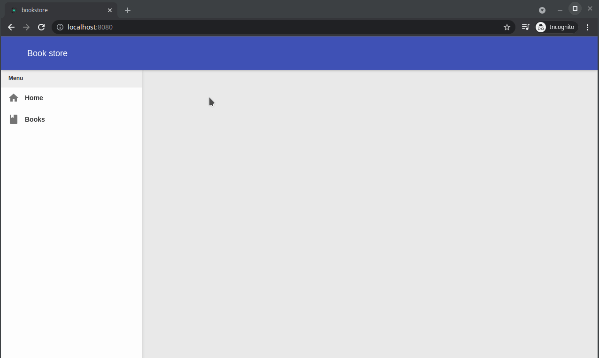

# Creating the home screen

We will again use Domino-cli to add a new proxy to our previously created shell module, the home screen will just show a welcome message.

- In the root folder of the project open a terminal and execute the following command

  `dominokit gen module -n shell -p home -sp shell`
- This will create a new proxy in the shell module named `HomeProxy`.

The home screen well depend on the shell and will show up in the content panel :

- In the `shell-shared` module delete the `HomeService` interface as we won't use it in this tutorial.
- In the `HomeProxy` remove the import of the `HomeServiceFactory`.
- In the `@PresenterProxy` set the parent to `parent = "shell"`.
- Change the slot to `@Slot(Slots.CONTENT)`
- Delete the `onHomeInit` and `onHomeRevealed` methods.
- Remove `implements HomeView.HomeUiHandlers`

  The home proxy should look like this after those changes

  ```java
  package org.dominokit.samples.shell.client.presenters;
  
  import org.dominokit.domino.api.client.annotations.presenter.AutoReveal;
  import org.dominokit.domino.api.client.annotations.presenter.AutoRoute;
  import org.dominokit.domino.api.client.annotations.presenter.PresenterProxy;
  import org.dominokit.domino.api.client.annotations.presenter.Slot;
  import org.dominokit.domino.api.client.mvp.presenter.ViewablePresenter;
  import org.dominokit.samples.shell.client.views.HomeView;
  import org.dominokit.samples.shell.shared.Slots;
  import org.slf4j.Logger;
  import org.slf4j.LoggerFactory;
  
  @PresenterProxy(parent = "shell")
  @AutoRoute(token = "home")
  @Slot(Slots.CONTENT)
  @AutoReveal
  public class HomeProxy extends ViewBaseClientPresenter<HomeView> {
      private static final Logger LOGGER = LoggerFactory.getLogger(HomeProxy.class);
  }
  ```

- Open the `HomeView` interface and delete `welcomeMessage` method.
- Remove the `HomeUiHandlers` interface.
- Remove the implements `HasUiHandlers<HomeView.HomeUiHandlers>` declaration.

  The `HomeView` class should look like the following after those changes :

  ```java
   package org.dominokit.samples.shell.client.views;
  
  import org.dominokit.domino.api.client.mvp.view.ContentView;
  
  public interface HomeView extends ContentView {
  }
  ```

- In the `shell-frontend-ui` open the `HomeViewImpl` class.
- Remove the `welcomeMessage` method and the `uiHandlers` field with its setter.

- Implement the `init` method like the following :

  ```java
   package org.dominokit.samples.shell.client.views.ui;
  
  import elemental2.dom.HTMLDivElement;
  import org.dominokit.domino.api.client.annotations.UiView;
  import org.dominokit.domino.ui.grid.Column;
  import org.dominokit.domino.ui.grid.Row;
  import org.dominokit.domino.ui.utils.DominoElement;
  import org.dominokit.domino.view.BaseElementView;
  import org.dominokit.samples.shell.client.presenters.HomeProxy;
  import org.dominokit.samples.shell.client.views.HomeView;
  
  import static org.jboss.elemento.Elements.h;
  
  @UiView(presentable = HomeProxy.class)
  public class HomeViewImpl extends BaseElementView<HTMLDivElement> implements HomeView{
  
    private DominoElement<HTMLDivElement> root = DominoElement.div();
  
    @Override
    public HTMLDivElement init() {
      root.appendChild(Row.create()
              .appendChild(Column.span6().offset3()
                      .appendChild(DominoElement.of(h(2)
                                      .textContent("Welcome to domino book store."))
                              .setTextAlign("center")
                      )
              )
      );
      return root.element();
    }
  }
  ```
  Now if we rebuild the application and refresh the browser and wait till the code server to finish the compilation, and click on home then the welcome message should show in the content.



  But normally if the browser is pointing at `http://localhost:8080` without the home screen, then we will notice that we are not being moved to home page by default, next we will make the application to take us to the home page if the URL does not specify any other page.
  
- In `ShellProxy` we left the `onShellRevealed` method empty, rename it to `openHomeByDefault` and now we will implement it to open the home page by default like this
  
  ```java
  package org.dominokit.samples.shell.client.presenters;
  
  import org.dominokit.domino.api.client.annotations.presenter.AutoReveal;
  import org.dominokit.domino.api.client.annotations.presenter.AutoRoute;
  import org.dominokit.domino.api.client.annotations.presenter.OnReveal;
  import org.dominokit.domino.api.client.annotations.presenter.PresenterProxy;
  import org.dominokit.domino.api.client.annotations.presenter.RegisterSlots;
  import org.dominokit.domino.api.client.annotations.presenter.Singleton;
  import org.dominokit.domino.api.client.annotations.presenter.Slot;
  import org.dominokit.domino.api.client.mvp.presenter.ViewablePresenter;
  import org.dominokit.domino.api.shared.extension.PredefinedSlots;
  import org.dominokit.samples.shell.client.views.ShellView;
  import org.dominokit.samples.shell.shared.Slots;
  import org.slf4j.Logger;
  import org.slf4j.LoggerFactory;
  
  @PresenterProxy(name = "Shell")
  @AutoRoute(routeOnce = true)
  @Slot(PredefinedSlots.BODY_SLOT)
  @AutoReveal
  @RegisterSlots({Slots.LEFT_PANEL, Slots.CONTENT})
  @Singleton
  public class ShellProxy extends ViewBaseClientPresenter<ShellView> {
  
    private static final Logger LOGGER = LoggerFactory.getLogger(ShellProxy.class);
  
    @OnReveal
    public void openHomeByDefault(){
      if(history().currentToken().isEmpty()){
        history().fireState("home");
      }
    }
  }
  ```
  
  Now rebuild the application again, and try to visit the URL `http://localhost:8080` and notice how it will take you to the home page and notice how the URL is changed to end with `/home`