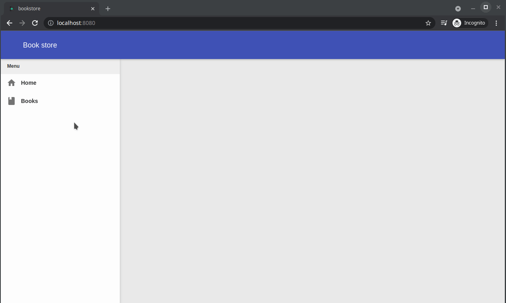

# Creating the menu

We will again use Domino-cli to add a new proxy to our previously created shell module, the menu will add entries to the shell left panel, when we click on one of the entries we update the URL with the entry token.

- In the root folder of the project open a terminal and execute the following command
    
    `dominokit gen module -n shell -p menu -sp shell`
- This will create a new proxy in the shell module named `MenuProxy`.

The menu is just like the shell, will be active regards of the token in the url, singleton and will be routed only once, but will be activated only after the shell is activated :

- In the `shell-shared` module delete the `MenuService` interface as we won't use it in this tutorial.
- In the `MenuProxy` remove the import of the `MenuServiceFactory`.
- In the `@PresenterProxy` set the parent to `parent = "shell"`.
- In the `@AutoRoute` remove the argument `token` and add `routeOnce = true`.
- Add `@Singleton`annotation.
- Change the slot to `@Slot(Slots.LEFT_PANEL)`
- Delete the `onMenuInit` and `onMenuRevealed` methods.

  The menu proxy should look like this after those changes

  ```java
  package org.dominokit.samples.shell.client.presenters;
  
  import org.dominokit.domino.api.client.annotations.presenter.AutoReveal;
  import org.dominokit.domino.api.client.annotations.presenter.AutoRoute;
  import org.dominokit.domino.api.client.annotations.presenter.PresenterProxy;
  import org.dominokit.domino.api.client.annotations.presenter.Singleton;
  import org.dominokit.domino.api.client.annotations.presenter.Slot;
  import org.dominokit.domino.api.client.mvp.presenter.ViewBaseClientPresenter;
  import org.dominokit.samples.shell.client.views.MenuView;
  import org.dominokit.samples.shell.shared.Slots;
  import org.slf4j.Logger;
  import org.slf4j.LoggerFactory;
  
  @PresenterProxy(name = "Menu", parent = "shell")
  @AutoRoute(routeOnce = true)
  @Singleton
  @Slot(Slots.LEFT_PANEL)
  @AutoReveal
  public class MenuProxy extends ViewBaseClientPresenter<MenuView> implements MenuView.MenuUiHandlers {
      private static final Logger LOGGER = LoggerFactory.getLogger(MenuProxy.class);
  }
  ```
  
- Open the `MenuView` interface and delete `welcomeMessage` method.

  The `MenuView` class should look like the following after those changes :
  
  ```java
  package org.dominokit.samples.shell.client.views;
  
  import org.dominokit.domino.api.client.mvp.view.ContentView;
  import org.dominokit.domino.api.client.mvp.view.HasUiHandlers;
  import org.dominokit.domino.api.client.mvp.view.UiHandlers;
  
  public interface MenuView extends ContentView, HasUiHandlers<MenuView.MenuUiHandlers> {
    interface MenuUiHandlers extends UiHandlers {
    }
  }
  ```
  
- In the `shell-frontend-ui` open the `MenuViewImpl` class.
- Remove the `welcomeMessage` method.
- Now we will use [Domino-ui](https://github.com/DominoKit/domino-ui) to implement a simple menu.
- Add a `menu` field and implement the `init` method like the following :

  ```java
  package org.dominokit.samples.shell.client.views.ui;
  
  import elemental2.dom.HTMLDivElement;
  import org.dominokit.domino.api.client.annotations.UiView;
  import org.dominokit.domino.ui.icons.Icons;
  import org.dominokit.domino.ui.tree.Tree;
  import org.dominokit.domino.ui.tree.TreeItem;
  import org.dominokit.domino.view.BaseElementView;
  import org.dominokit.samples.shell.client.presenters.MenuProxy;
  import org.dominokit.samples.shell.client.views.MenuView;
  
  @UiView(presentable = MenuProxy.class)
  public class MenuViewImpl extends BaseElementView<HTMLDivElement> implements MenuView{
  
      private MenuUiHandlers uiHandlers;
      private Tree<String> menu= Tree.create("Menu");
  
      @Override
      public HTMLDivElement init() {
          menu
                  .appendChild(TreeItem.create("Home", Icons.ALL.home_mdi(), "home"))
                  .appendChild(TreeItem.create("Books", Icons.ALL.book_mdi(), "books"))
                  .addItemClickListener(treeItem -> uiHandlers.onMeuSelected(treeItem.getValue()));
          return menu.element();
      }
  
  
      @Override
      public void setUiHandlers(MenuUiHandlers uiHandlers) {
          this.uiHandlers = uiHandlers;
      }
  }
  ```
- Notice we added this call `.addItemClickListener(treeItem -> uiHandlers.onMeuSelected(treeItem.getValue()));` so we need to add this method the `MenuUiHandlers` interface.

- In the `MenuView.MenuUiHandlers` interface add the method ` void onMeuSelected(String token);`

- Implement the method in the `MenuProxy` like the following :

  ```java
  package org.dominokit.samples.shell.client.presenters;
  
  import org.dominokit.domino.api.client.annotations.presenter.AutoReveal;
  import org.dominokit.domino.api.client.annotations.presenter.AutoRoute;
  import org.dominokit.domino.api.client.annotations.presenter.PresenterProxy;
  import org.dominokit.domino.api.client.annotations.presenter.Singleton;
  import org.dominokit.domino.api.client.annotations.presenter.Slot;
  import org.dominokit.domino.api.client.mvp.presenter.ViewBaseClientPresenter;
  import org.dominokit.samples.shell.client.views.MenuView;
  import org.dominokit.samples.shell.shared.Slots;
  import org.slf4j.Logger;
  import org.slf4j.LoggerFactory;
  
  @PresenterProxy(parent = "shell")
  @AutoRoute(routeOnce = true)
  @Singleton
  @Slot(Slots.LEFT_PANEL)
  @AutoReveal
  public class MenuProxy extends ViewBaseClientPresenter<MenuView> implements MenuView.MenuUiHandlers {
  
      private static final Logger LOGGER = LoggerFactory.getLogger(MenuProxy.class);
  
      @Override
      public void onMeuSelected(String token) {
          history().fireState(token);
      }
  }
  ```
  Now if we rebuild and run the application we will have a menu on the left panel and when we click a menu entry the browser URL should change.

