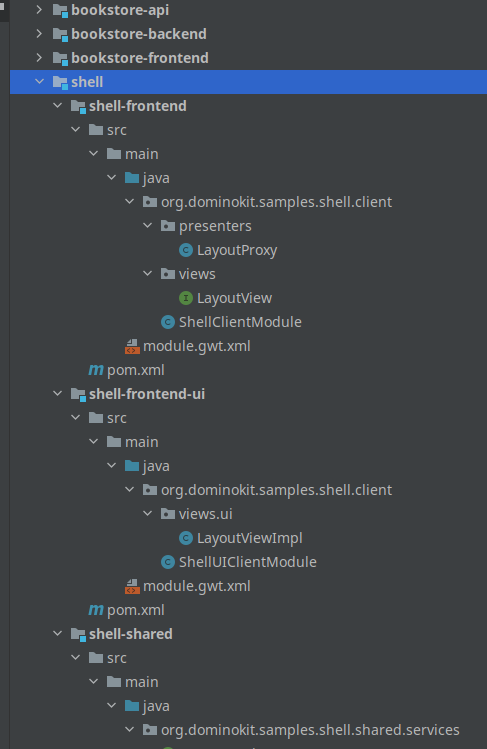
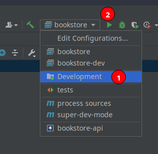
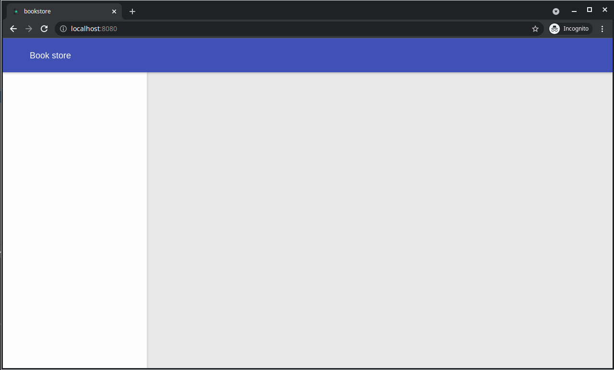

# Creating the shell

To create the shell of the application we will also use Domino-cli. the shell will be activated in regard of the token, and should be a singleton, with only route once, and should register two slots `left-panel` and `content`. 

- In the root folder of the project open a terminal and execute the following command
    
    `dominokit gen module -n shell -p shell -sp shell`
- This will create a shell module in the project with a shell proxy



Now we will edit the shell module before test and run our application :

- In the `shell-shared` module delete the `ShellService` interface as we won't use it in this tutorial.
- In the `ShellProxy` remove the import of the `ShellServiceFactory`.
- In the `@AutoRoute` remove the argument `token` and add `routeOnce = true`.
- Add `@Singleton`annotation.
- Remove the `implements ShellView.ShellUiHandlers` part
- Delete the method `onShellInit`.
- Delete the content of the method `onShellRevealed` but keep the method.
- Now back to the `shell-shared` module and add a class `Slots` with 2 constants as the following 
  ```java
  package org.dominokit.samples.shell.shared;
  
  public class Slots {
    public static final String LEFT_PANEL="left-panel";
    public static final String CONTENT="content";
  }
  ```
- Now back to the `ShellProxy` class, add the annotation `@RegisterSlots({Slots.LEFT_PANEL, Slots.CONTENT})`

  The shell proxy should look like this after those changes

  ```java
  package org.dominokit.samples.shell.client.presenters;
  
  import org.dominokit.domino.api.client.annotations.presenter.AutoReveal;
  import org.dominokit.domino.api.client.annotations.presenter.AutoRoute;
  import org.dominokit.domino.api.client.annotations.presenter.OnReveal;
  import org.dominokit.domino.api.client.annotations.presenter.PresenterProxy;
  import org.dominokit.domino.api.client.annotations.presenter.RegisterSlots;
  import org.dominokit.domino.api.client.annotations.presenter.Singleton;
  import org.dominokit.domino.api.client.annotations.presenter.Slot;
  import org.dominokit.domino.api.client.mvp.presenter.ViewBaseClientPresenter;
  import org.dominokit.domino.api.shared.extension.PredefinedSlots;
  import org.dominokit.samples.shell.client.views.ShellView;
  import org.dominokit.samples.shell.shared.Slots;
  import org.slf4j.Logger;
  import org.slf4j.LoggerFactory;
  
  @PresenterProxy(name = "Shell")
  @AutoRoute(routeOnce = true)
  @Singleton
  @Slot(PredefinedSlots.BODY_SLOT)
  @AutoReveal
  @RegisterSlots({Slots.LEFT_PANEL, Slots.CONTENT})
  public class ShellProxy extends ViewBaseClientPresenter<ShellView> {
  
      private static final Logger LOGGER = LoggerFactory.getLogger(ShellProxy.class);
  
      @OnReveal
      public void onShellRevealed() {
      }
  }
  ```
  
- Open the `ShellView` interface and delete `welcomeMessage` method.
- delete the `ShellUiHandlers` inner interface.
- Remove the extends of `HasUiHandlers`.

  The `ShellView` class should look like the following after those changes :
  
  ```java
  package org.dominokit.samples.shell.client.views;
  
  import org.dominokit.domino.api.client.mvp.view.ContentView;
  
  public interface ShellView extends ContentView {
  
  }
  ```
  
- In the `shell-frontend-ui` open the `ShellViewImpl` class.
- Remove the `uiHandlers` field and its setter method.
- Remove the `welcomeMessage` method.
- Now we will use [Domino-ui](https://github.com/DominoKit/domino-ui) to implement a simple layout.
- Add a `layout` field and implement the `init` method like the following :

  ```java
  package org.dominokit.samples.shell.client.views.ui;
  
  import elemental2.dom.HTMLDivElement;
  import org.dominokit.domino.api.client.annotations.UiView;
  import org.dominokit.domino.ui.layout.Layout;
  import org.dominokit.domino.view.BaseElementView;
  import org.dominokit.samples.shell.client.presenters.ShellProxy;
  import org.dominokit.samples.shell.client.views.ShellView;
  
  @UiView(presentable = ShellProxy.class)
  public class ShellViewImpl extends BaseElementView<HTMLDivElement> implements ShellView{
  
      private Layout layout= Layout.create("Book store");
  
      @Override
      public HTMLDivElement init() {
          layout.autoFixLeftPanel();
          return layout.element();
      }
  }
  ```
  
- Now try to build the project, and we should get an error saying something like this
  
  ```
  java: cannot find symbol
  symbol:   method getLeftPanelSlot()
  location: variable view of type V
  ```
  This is because the proxy is registering slots, but these slots are not implemented by the view, we will fix them next.
- Open the `ShellView` interface and make it extend from `ShellProxySlots` generated interface

  ```java
  package org.dominokit.samples.shell.client.views;
  
  import org.dominokit.domino.api.client.mvp.view.ContentView;
  import org.dominokit.samples.shell.client.presenters.ShellProxySlots;
  
  public interface ShellView extends ContentView, ShellProxySlots {
  
  }  
  ```

- Open the `ShellViewImpl` and make it implement the two new methods like the following :

  ```java
      @Override
      public IsSlot<?> getLeftPanelSlot() {
          return SingleElementSlot.of(layout.getLeftPanel());
      }
  
      @Override
      public IsSlot<?> getContentSlot() {
          return SingleElementSlot.of(layout.getContentPanel());
      }
  ```
  
  If we build again, the error should be gone.
- Now in the project root folder open a terminal and run `mvn clean install`.

### Running the project

For Intellij Idea users this should be just picking the `Development` run configuration then click run



but we can also run from the terminal, following the instructions in the readme file.

In project root folder :

- In one terminal run `mvn gwt:codeserver -pl *-frontend -am`
  > This will run the code-server that will incrementally build the project and compile it to javascript as we make changes
- In another terminal `cd bookstore-backend`
- execute `mvn exec:java`
  > This will run the server that serves out index page the javascript being compiled out of our application and any other static resources.
- In the browser open `http://localhost:8080`
- The code server will start compiling the application and will show a message saying `Compiling bookstore`
- Wait until it finish, and you should see the application layout.
  
