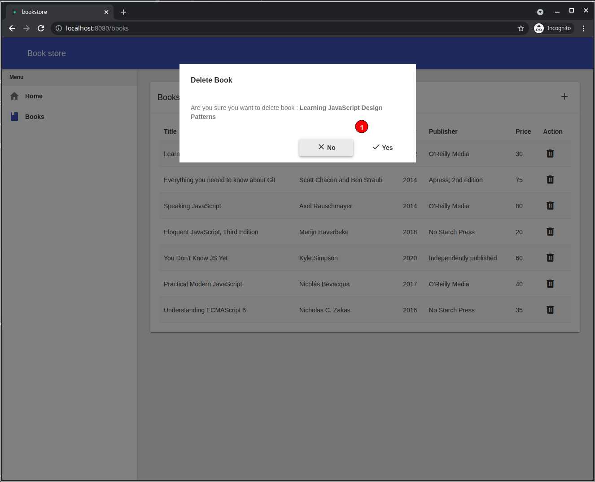

# Tutorial: Book Store

In this Domino-mvp tutorial we are going to implement the GUI for a simple book store application, we will not go into the details about the backend, but will focus on how we do things in the frontend side, we will start with an overview of the application :

### Overview

The application will use a standard simple layout with the following : 

- Side menu **(1)**.
- Main content **(2)**.
- As we navigate we will update the URL **(3)**.

When we click on home on the side menu the application should take us to the home screen, and when we click on Books it should take us to the books list screen, the url should point to `books` **(1)**, books will show up in a grid **(2)**, when the plus sign **+** **(3)** is clicked we will open a dialog to add a new book, and when we click the delete button in the grid **(4)** we will confirm the delete operation before executing it.

In the books list if we click on a book record we change the url **(1)** and open the book details screen **(2)**, in the screen we can edit book **(3)** or we can navigate back to the books list **(4)**

from the books list if click on add we open the add new book dialog **(1)**, then we either fill and validate then save the book then navigate to the added book details, or we cancel the operation and navigate back to the book list **(2)**

To delete a book we show a confirmation dialog and execute the operation only when user click `yes` **(1)**

