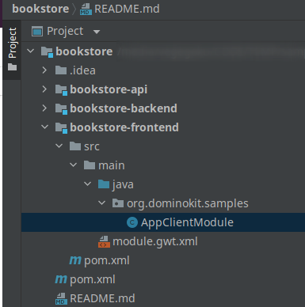

# Creating the book store project

#### Prerequisites :

- Java 8 or 11
- Maven 3.6.3+
- An IDE of your choosing, **Intellij Idea** is preferred

We will use [Domino-cli](https://github.com/DominoKit/domino-cli) to create the new project

- Open a terminal in a folder of your choosing and execute the following command 

  `dominokit gen app -t mvp -n bookstore -g org.dominokit.samples`
- A new folder will be created containing the project, import the project into the IDE.

The IDE should have the following structure

We can do `mvn clean install` in the terminal to make sure everything compiles.